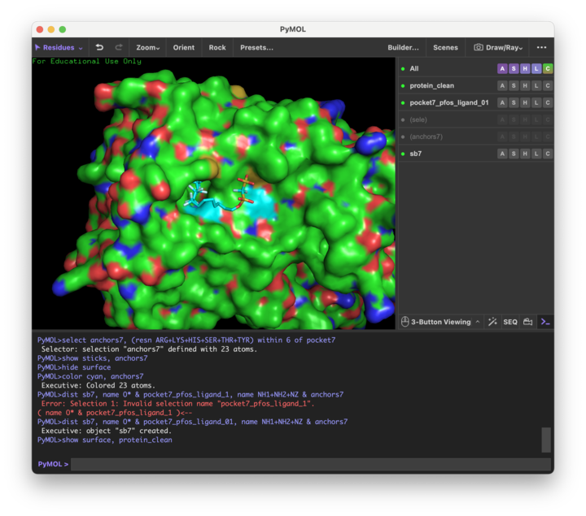

# Process for identification of PFAS transporters

### Transporter candidate search 
First, I tried to identify likely *E. coli* transporters for a single PFAS, namely PFOS.

1. Queried PFOS in the [CompTox Dashboard](https://comptox.epa.gov/dashboard/chemical/invitrodb/DTXSID3031864). Filtered TOXCAST transporter bioassays and retrieved list of gene symbols.
    - For PFOS, these were:
        - SLC5A5, ABCG2, FABP1, SLC22A1, IGFBP1, ABCC2, SLCO1B1, ABCB11
2. Retrieved FASTA sequences for these genes from [UniProt](https://www.uniprot.org/).
    - File is in **uniprot_data**
3. Ran [BLAST](https://blast.ncbi.nlm.nih.gov/Blast.cgi) for these sequences against the *E. coli* genome.
    - Results are in **blast/PFOS**
4. Most of the returned sequences were simply labeled "MFS Superfamily" and didn't have any associated function information. Ran [batch conserved domain search](https://www.ncbi.nlm.nih.gov/Structure/bwrpsb/bwrpsb.cgi) on the accessions.
    - Parsed the CD-search results and saved them to **blast/PFOS/cd_dict.json**. This is a python dict where each sequence from BLAST is mapped to analogous specific sequences in the MFS, sorted by bitscore. These are the "annotated" sequences.
    - For most of the sequences, the most similar MFS transporter was [MFS_SV2_like](https://www.uniprot.org/uniprotkb/Q7L1I2/entry), which is a secretion regulator and neurotoxin receptor. 
5. Next steps: use ESM to compare raw and "annotated" *E. coli* protein sequences against the known PFOS transporters to identify the best candidate/most likely importer for our purposes.

### Molecular docking/binding affinity prediction

1. From the conserved domain page for [MFS_SV2_like](https://www.uniprot.org/uniprotkb/Q7L1I2/entry), I selected a "representative protein" for *E. coli* K-12, namely [YaaU](https://www.ncbi.nlm.nih.gov/protein/P31679.2), a putative metabolite membrane transport protein. This selection was mostly random, so need to try other representative/specific members of the SV2-like family.
2. Retrieved the predicted 3D structure of YaaU from the [AlphaFold DB](https://alphafold.ebi.ac.uk/entry/P31679?activeTab=summary). This was a reasonably high confidence prediction.
3. Ran [fpocket](https://github.com/Discngine/fpocket) on the protein structure to identify the most promising binding site. Results are in pocket/yaau. Pocket 7 had the highest druggability score of 0.789, so proceeded with that one.
4. Ran Autodock Vina, supplying the centroid coordinates of pocket 7 as well as a PFOS structure in SMILES format. Results are in docking/yaau and shown in the image below. 
